# 人工智能网站

为学校所设新专业（人工智能）而做的**响应式**网站，美观简洁。
地址：https://git.openkub.com/zhangwenxuan/aiweb_new

## 使用框架

- **<a href="https://getbootstrap.com/ " style="color:black">bootstrap5</a>**
- **<a href="https://vuejs.org/"  style="color:black">vue.js</a>**

## 内部网页

- 首页

- 竞赛

  - 赛事介绍
  - 相册
  - 精彩时刻
  - 新闻

- 校园生活

  - 心理健康
    - 心理咨询
  - 饮食与住宿
  - 健康与安全
  - 设施预约
  - 学生社团
  - 校内医院
  - 请假

- 教学

  - 教学大纲
  - 教学计划
  - 考核
  - 学分
  - 课程分配
    - 分配详情

- 研究

  - 科研项目
  - 教学研究
  - 实验室
  - 创客

- 规章制度

- 校内新闻

  - 新闻详情

- 就业与实习

  - 证书
  - 岗位

- 合作伙伴

  - 企业

- 入学申请

  - 准备材料
  - 提交申请

- 近期活动

  - 活动详情

- 关于我们

- 网站地图

## 设计

美观简洁，内容清晰

样式基于

1. 奥运会官网
2. 斯坦福官网
3. 哈佛官网

## 部分页面展示

小屏幕截不全另外截一张省略部分

### 首页展示

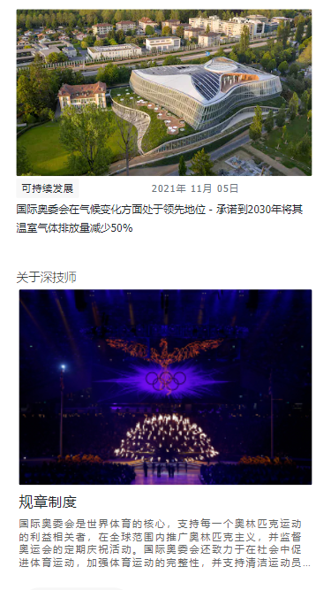

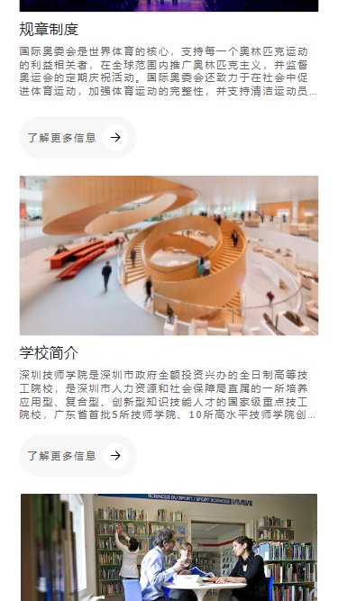

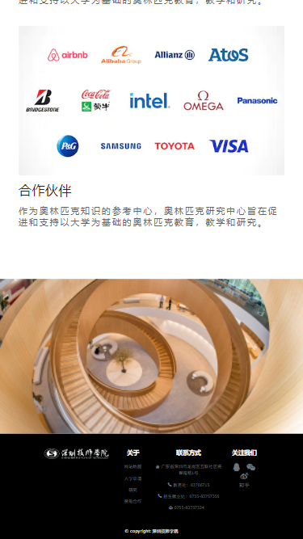

### 校园生活页

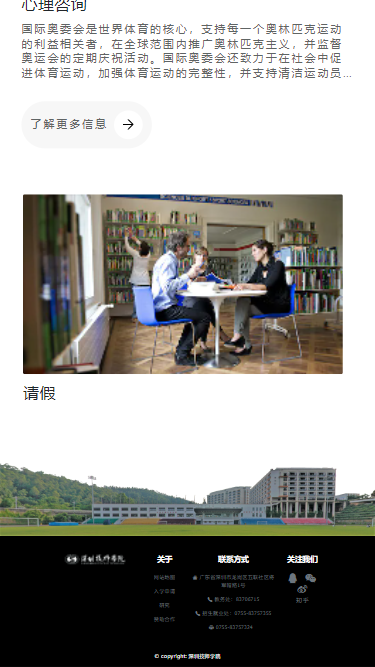

###教学研究页

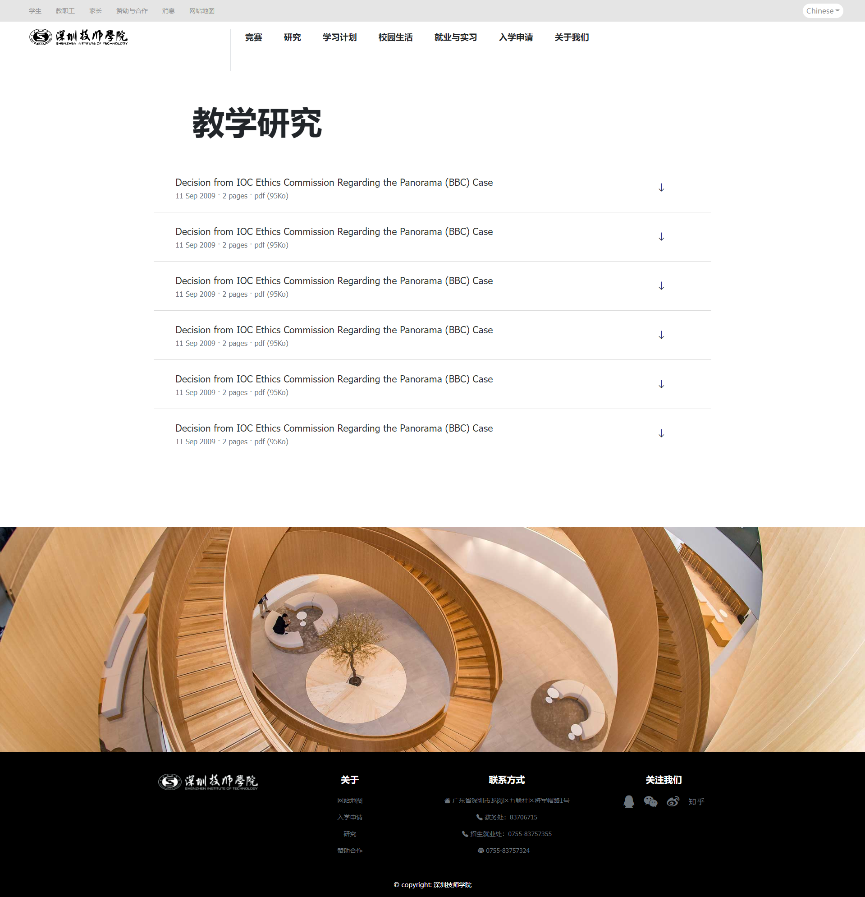

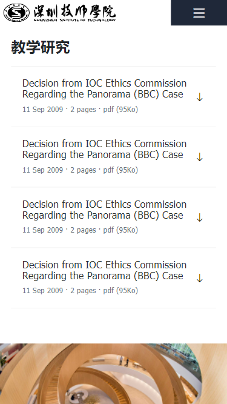

### 新闻详情页

### 近期活动页

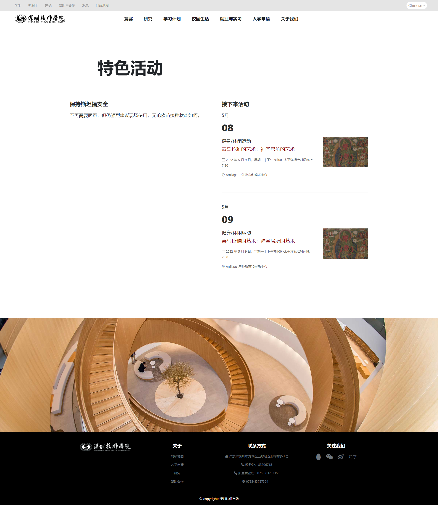
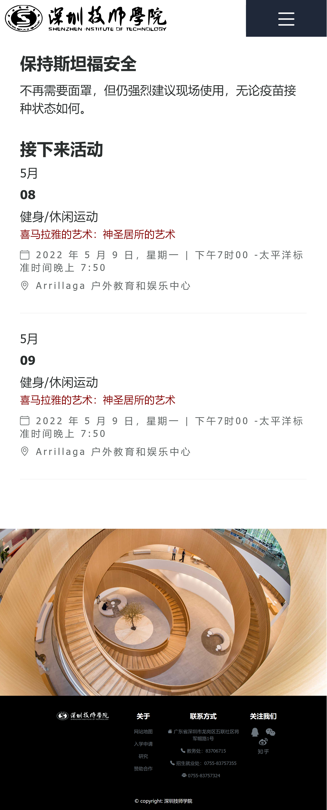

### 竞赛页

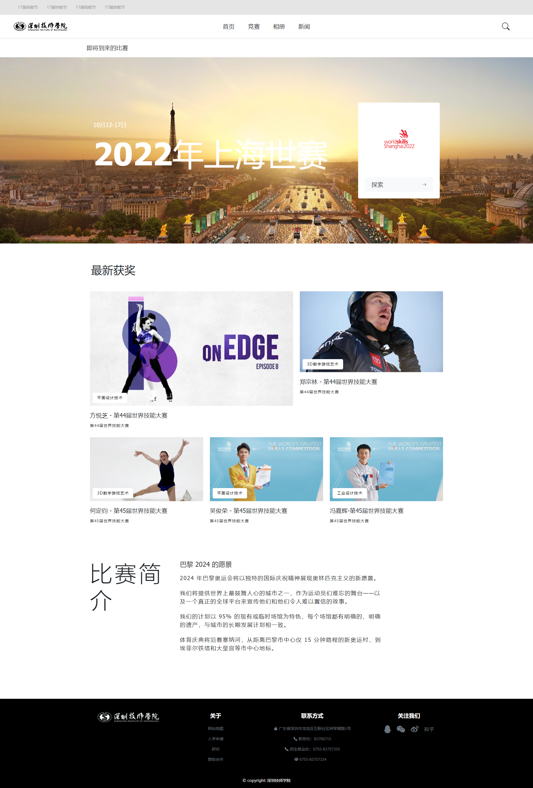

### 高光时刻

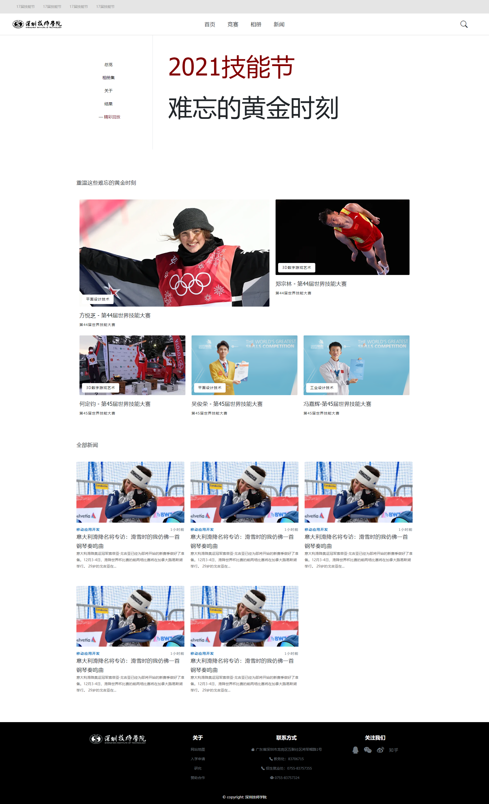

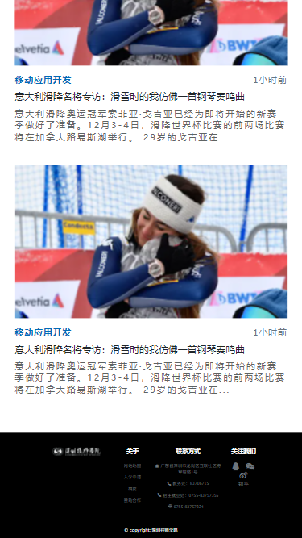

### 竞赛新闻

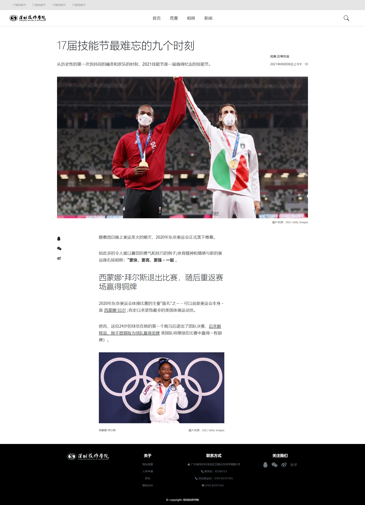
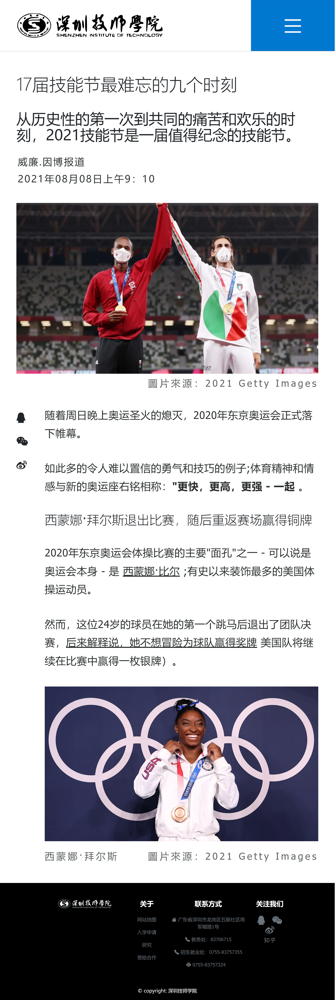

### 饮食与住宿

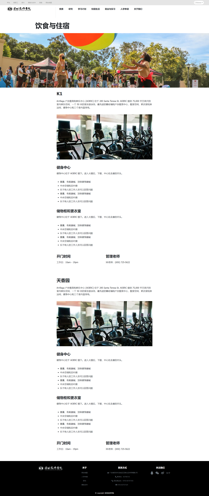

## 开发过程

前期没有设计图，也没积极沟通导致页面风格一直变化，长期处于做完页面推倒重来的状态。

发现有时候打开网站需要很长时间，有时又很迅速，原因竟是chrome浏览器的问题....

反复重来的过程中慢慢摸索出一些搭配的直觉，深刻体会到设计图的重要性。

为做设计图，花大量时间在上述及其他网站中总结如何使元素更融洽的摆放。

但细节方面却总不到位，怀疑是中英文的差异导致视觉效果不一致，于是在中文的网站上学习总结怎样使中文字体有更好的视觉效果。

虽然中文网站上的字体表现力都差不多，但都比我的给人感觉更清晰简洁，遂开始总结实验将实验效果较好的用在网站上。

## 项目总结

花费时间长主要原因是没有设计图，反复重来。

没有经验，导致踩了各种各样的坑。

虽还有不足，但整体样式还比较ok。